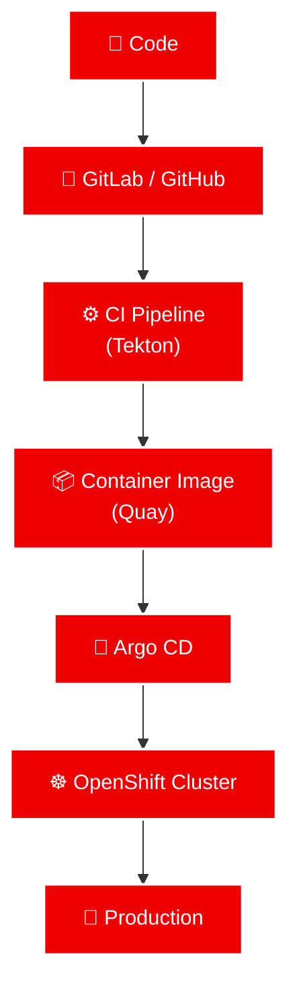

---

# 💡 About Me

I'm passionate about designing, automating and operating enterprise-grade cloud platforms.

My daily work focuses on helping organizations adopt **Cloud Native** technologies using **Red Hat OpenShift**, Kubernetes and GitOps practices.

I enjoy solving complex infrastructure challenges and transforming manual processes into automation.

---

---

# 🛠 Tech Stack

---

# 🎯 Areas of Expertise

- ☸️ Red Hat OpenShift
- ☸️ Kubernetes
- 🔴 Red Hat Enterprise Linux
- 🔐 Red Hat Build of Keycloak
- 🖥️ JBoss EAP
- 🚀 GitOps
- 🔄 Argo CD
- ⚙️ Tekton Pipelines
- 📦 Quay Registry
- 🤖 Ansible Automation Platform
- ☁️ Cloud Native Architecture
- 🛡 DevSecOps
- 📈 Middleware Engineering

---

# 🌱 Currently Exploring

- Artificial Intelligence for Platform Engineering
- LLM Applications
- Observability
- FinOps

---

# 🚀 Featured Projects

Explore my repositories for enterprise-grade solutions in cloud infrastructure, DevOps automation, and platform engineering. Visit my [GitHub profile](https://github.com/pedroarraes) for the complete portfolio.

---

# 📈 Development Workflow

---

# 🤝 Let's Connect

---

